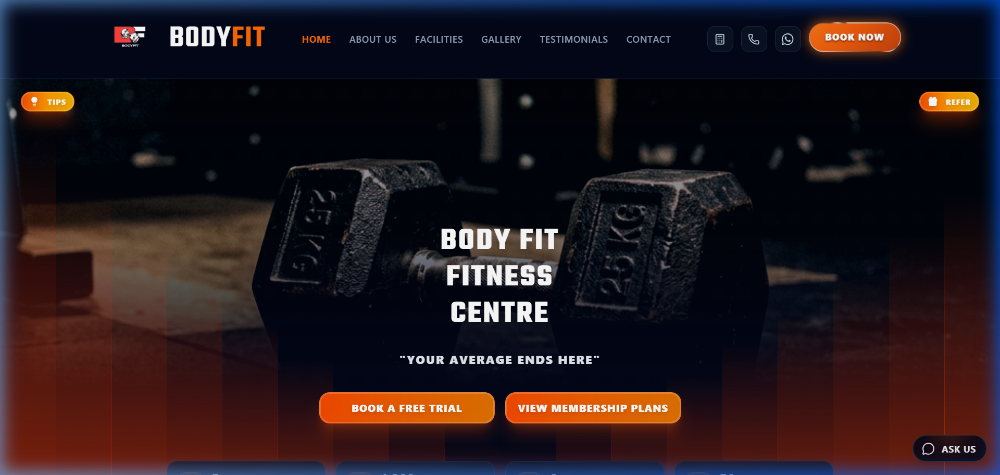
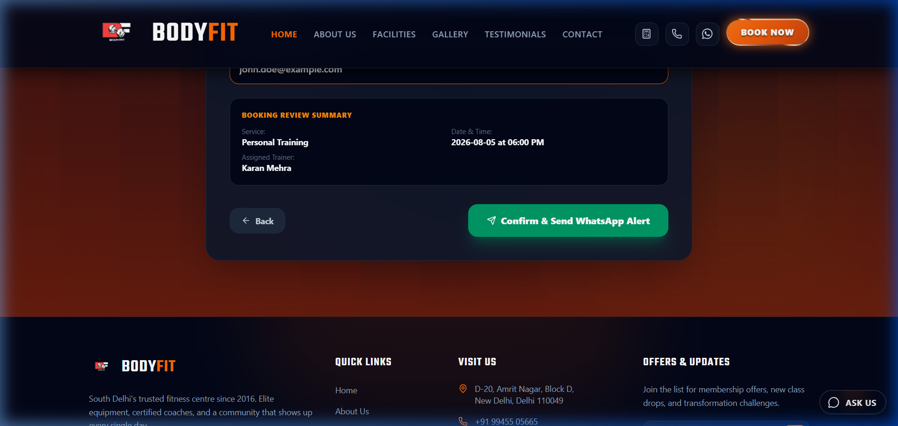
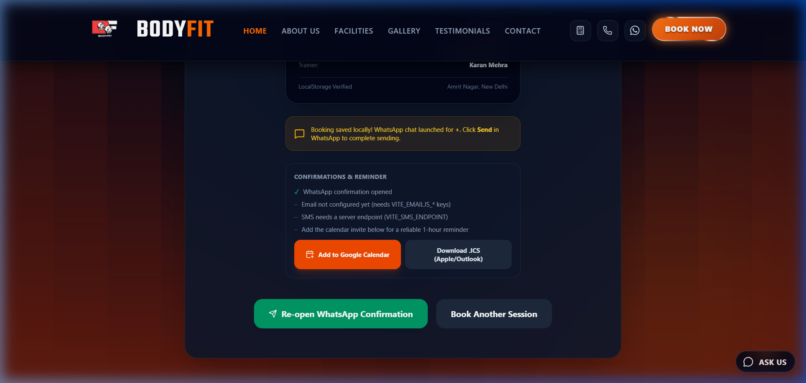
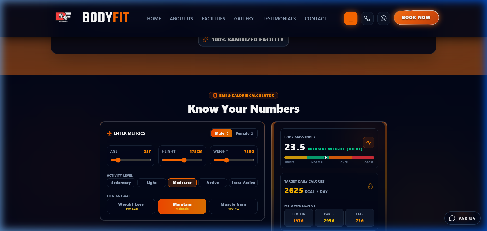
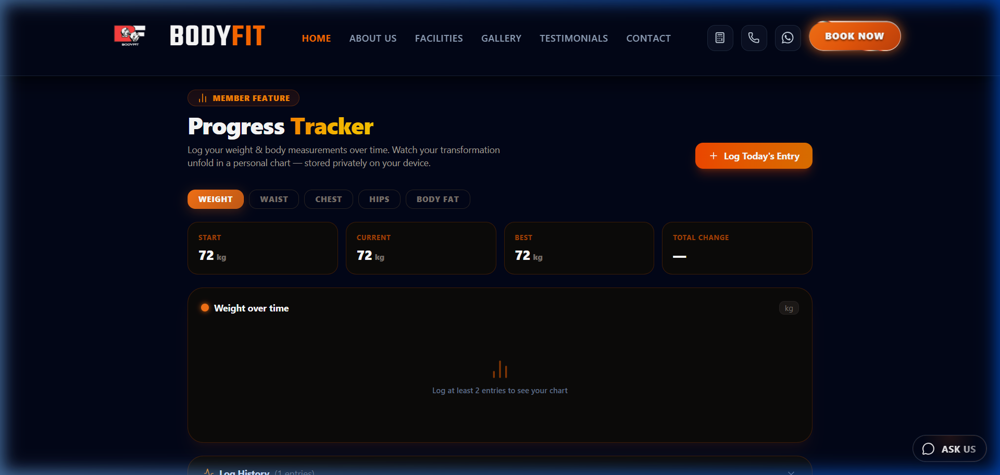
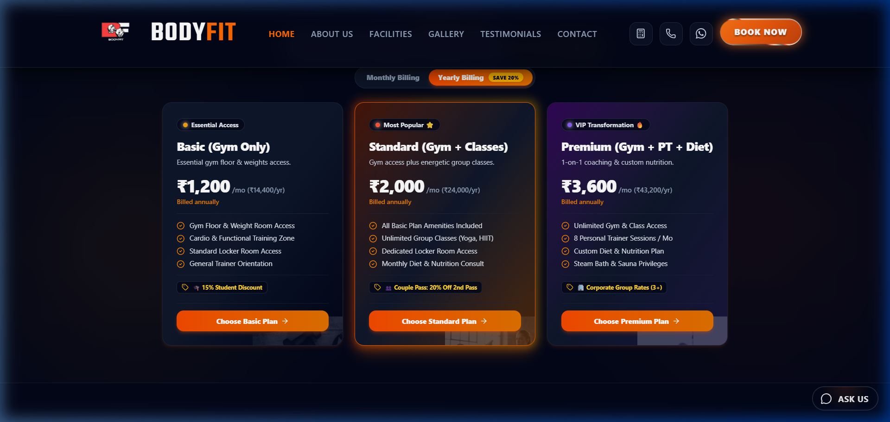
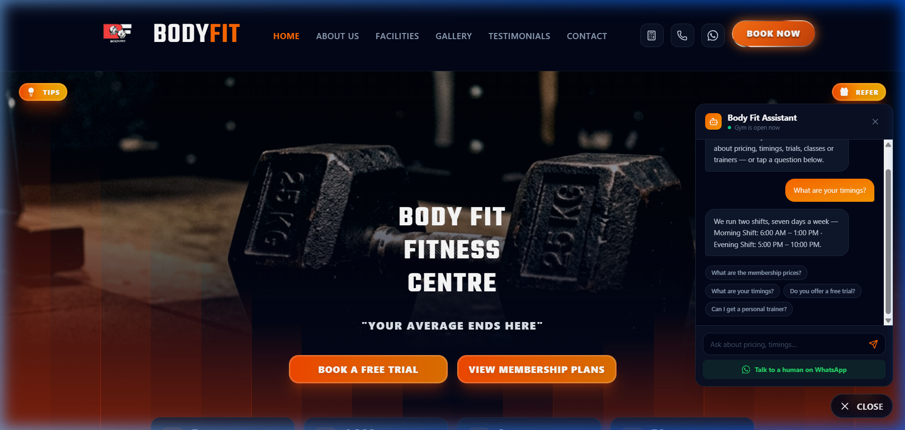
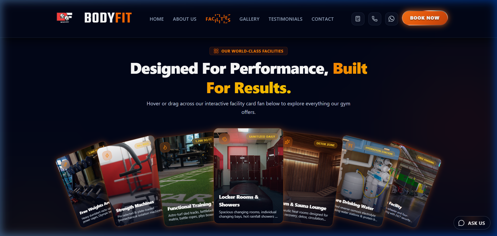

# 🏋️ BodyFit Fitness Centre Web Application

A modern, high-performance, and feature-rich Web Application designed for **BodyFit Fitness Centre**. Built using **React 19**, **Vite**, **Tailwind CSS v4**, **Framer Motion**, and **GSAP**, this application delivers an ultra-smooth, visually engaging user experience with interactive tools for fitness enthusiasts.

---

## 📸 Screenshots & Showcase

### 💥 Hero Section & Landing Banner
> *Dark-mode dynamic aesthetic with fast call-to-action buttons for trial booking and membership selection.*



---

### 📅 Multi-Step Class & Trial Booking System with WhatsApp Integration
> *Seamless 4-step booking workflow (Service -> Time Slot -> Trainer -> Contact Details) with automatic instant calendar export (.ICS) and WhatsApp reservation integration.*

| 📝 Step 4: Details & Summary | 🎉 Pass Active Confirmation |
| :---: | :---: |
|  |  |

---

### 📊 Health & Fitness Interactive Tools

#### 🧮 Interactive BMI & Calorie Macro Calculator
> *Real-time body mass index calculation, target daily calorie output, and exact macro splits (Protein, Carbs, Fats).*



#### 📈 Personal Body Measurement & Progress Tracker
> *Log weight, waist, chest, hips, and body fat percentage with local storage persistence and trend tracking.*



---

### 💳 Tiered Membership Plans (Monthly vs Yearly Discount Toggle)
> *Interactive pricing tiers with real-time billing frequency toggle and instant checkout.*



---

### 🤖 AI Assistant & Interactive Support Chatbot
> *Instant answers for gym timings, location, class schedules, and trial pass inquiries.*



---

### 🏋️‍♂️ State-of-the-Art Facilities & Equipment
> *Interactive showcase of gym equipment, functional training areas, and amenities.*



---

## ✨ Key Features

- **⚡ Fast & Modern UI**: Built with React 19 and Vite for instant load times and hot-module replacement (HMR).
- **🎨 Glassmorphism & Sleek Dark Mode**: Micro-animations using Framer Motion and GSAP animations.
- **📅 Interactive Booking Engine**: Reserve free trial passes or personal trainer slots with auto-generated booking IDs.
- **📱 Instant WhatsApp Booking Alert**: Automatically formats and pre-fills WhatsApp messages for direct front-desk confirmation.
- **📆 Calendar Export**: One-click download of `.ics` calendar events and direct Google Calendar integration.
- **🧮 Comprehensive Health Suite**:
  - BMI & Macro Nutrient Calculator
  - Multi-Metric Body Measurement Progress Logger (Persisted via LocalStorage)
- **🤖 Smart Interactive Assistant**: Quick FAQ chatbot helper for common visitor queries.
- **💳 Dynamic Membership Billing**: Toggle between Monthly and discounted Yearly rates.
- **💬 Social Proof & Live Reviews**: Dynamic client feedback feed and trainer highlight profiles.

---

## 🛠️ Tech Stack & Dependencies

- **Frontend Core**: React 19, JavaScript (ESNext)
- **Build Tool**: Vite 8
- **Styling**: Tailwind CSS v4, PostCSS, Autoprefixer
- **Animations**: Framer Motion, GSAP
- **Icons**: Lucide React, React Icons
- **Utility Libraries**: `clsx`, `tailwind-merge`, `class-variance-authority`, `@paper-design/shaders`
- **Linting**: Oxlint

---

## 🚀 Getting Started

### Prerequisites
Make sure you have [Node.js](https://nodejs.org/) installed (v18+ recommended).

### Installation

1. **Clone the repository**
   ```bash
   git clone https://github.com/dontcodejunaid/BodyFit.git
   cd BodyFit
   ```

2. **Install dependencies**
   ```bash
   npm install
   ```

3. **Run the development server**
   ```bash
   npm run dev
   ```
   Open `http://localhost:5173` in your web browser.

4. **Build for production**
   ```bash
   npm run build
   ```

5. **Preview production build**
   ```bash
   npm run preview
   ```

---

## 📂 Project Structure

```
BodyFit/
├── public/                # Static assets, icons & README screenshots
├── src/
│   ├── assets/            # Media assets & background graphics
│   ├── components/        # React components
│   │   ├── ui/            # Reusable UI primitives & animated text
│   │   ├── About.jsx      # Gym history & overview
│   │   ├── BMICalculator.jsx # Health & macro tool
│   │   ├── BookingForm.jsx  # Multi-step booking modal workflow
│   │   ├── Facilities.jsx # Gym amenities showcase
│   │   ├── Hero.jsx       # Landing page hero banner
│   │   ├── MembershipPlans.jsx # Tiered pricing
│   │   ├── ProgressTracker.jsx # Body measurement logger
│   │   ├── Trainers.jsx   # Certified personal trainers list
│   │   └── ...
│   ├── context/           # React context providers
│   ├── App.jsx            # Main app container
│   ├── main.jsx           # Entry point
│   └── index.css          # Tailwind CSS configuration & global styles
├── package.json
├── vite.config.js
└── README.md
```

---

## 📄 License

This project is created for **BodyFit Fitness Centre**. All rights reserved.
